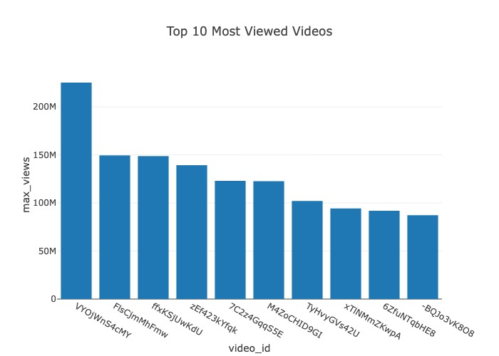
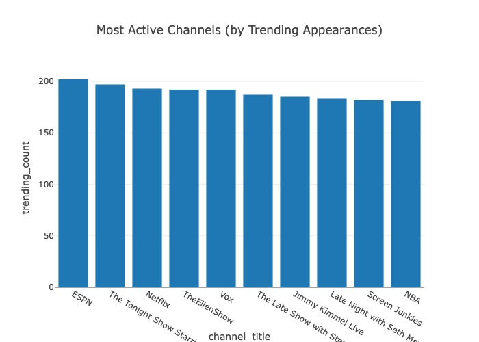
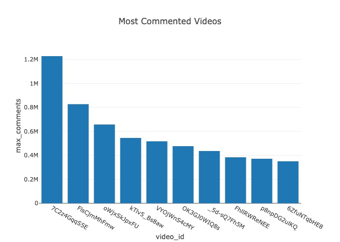
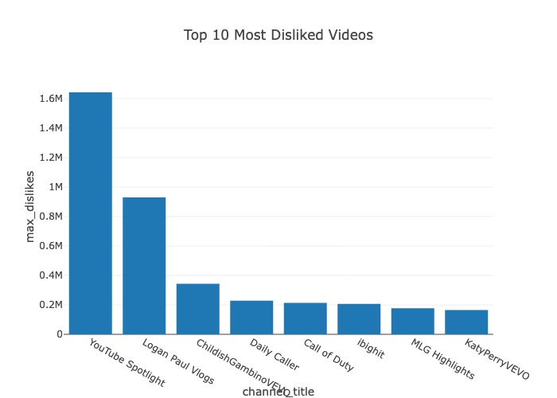
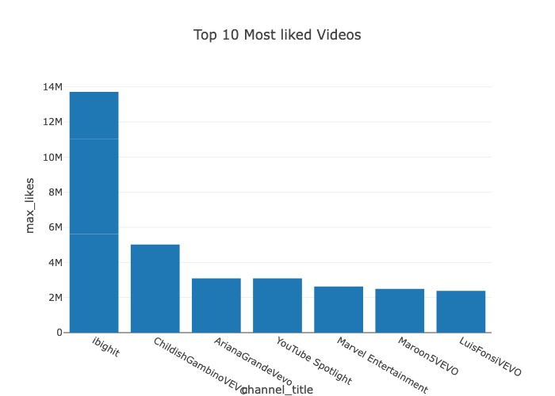

# YouTube Trending Videos Analytics Pipeline

This project is an end-to-end **data engineering pipeline** that
ingests, processes, and analyzes trending YouTube video data using
**Python, AWS Glue, Amazon S3, and Amazon Redshift Serverless**. It
demonstrates how to build a scalable ETL pipeline for analytics
purposes.

## ✨ Project Architecture

    YouTube Trending CSV (Raw Data)
              |
              v
      S3 (youtube-data-raw)
              |
              v
    AWS Glue Job (Cleaning, Deduplication)
              |
              v
      S3 (youtube-data-processed - Parquet)
              |
              v
      AWS Glue Catalog Table (External Table)
              |
              v
    Amazon Redshift Serverless (Analysis Queries)

## 📊 Data Source

- **Dataset:**
  [USvideos.csv](https://www.kaggle.com/datasets/datasnaek/youtube-new)
- **Content:** Daily statistics about trending YouTube videos in the
  United States.

## 🚀 Steps Performed

### 1. **Raw Data Upload to S3**

- Uploaded `USvideos.csv` using s3_upload_script.py to:

<!-- -->

- s3://youtube-video-data-naveen/youtube-data-raw/

### 2. **Data Cleaning with AWS Glue Job**

- Created Glue job `youtube_etl_pipeline_job` using PySpark script:

<!-- -->

    raw_df = spark.read.option("header", True).csv("s3://youtube-video-data-naveen/youtube-data-raw/USvideos.csv")
    cleaned_df = raw_df.dropDuplicates().na.drop()
    cleaned_df.write.mode("overwrite").parquet("s3://youtube-video-data-naveen/youtube-data-processed/")

- Output is written in **Parquet** format for optimized querying in the
  s3 bucket at :

> `s3://youtube-video-data-naveen/youtube-data-processed/`

### 3. **Glue Data Catalog**

- Created the glue Crawler and run to find the schema of the raw data
- Created external database: `youtube_glue_db`
- Created table pointing to processed S3 Parquet data.

### 4. **Amazon Redshift Serverless**

- Connected to default workgroup and namespace.
- Connected to the default database .
- Created the Tables according to the Schema provided by the Glue
  Crawler.
- Copied the processed data from the s3 bucket.

## 📊 Analysis Queries

**Here are some output report analysis from AWS REDSHIFT SERVERLESS**

**1. Top 10 Most Viewed Videos**

SELECT video_id, title, channel_title, views

FROM youtube_videos

WHERE views \~ \'\^\[0-9\]+\$\'

ORDER BY CAST(views AS BIGINT) DESC

LIMIT 10;

**2. Top 10 Most Liked Videos**

SELECT video_id, title, channel_title, MAX(CAST(likes AS BIGINT)) AS
max_likes

FROM youtube_videos

WHERE likes \~ \'\^\[0-9\]+\$\'

GROUP BY video_id, title, channel_title

ORDER BY max_likes DESC

LIMIT 10;

**3. Top 10 Most Disliked Videos**

SELECT video_id, title, channel_title, MAX(CAST(dislikes AS BIGINT)) AS
max_dislikes

FROM youtube_videos

WHERE dislikes \~ \'\^\[0-9\]+\$\'

GROUP BY video_id, title, channel_title

ORDER BY max_dislikes DESC

LIMIT 10;

**4. Most Active Channels (by Trending Appearances)**

SELECT channel_title, COUNT(\*) AS trending_count

FROM youtube_videos

GROUP BY channel_title

ORDER BY trending_count DESC

LIMIT 10;

**5. Most Commented Videos**

SELECT video_id, title, channel_title, MAX(CAST(comment_count AS
BIGINT)) AS max_comments

FROM youtube_videos

WHERE comment_count \~ \'\^\[0-9\]+\$\'

GROUP BY video_id, title, channel_title

ORDER BY max_comments DESC

LIMIT 10;

## 📚 Learnings

- Used **AWS Glue** for serverless ETL.
- Optimized storage using **Parquet** format.
- Integrated **Redshift Serverless** with Glue Catalog.
- Applied SQL queries for business insights.

## 📅 Future Improvements

- Automate ingestion using **AWS Lambda + CloudWatch**.
- Add **Athena** for ad-hoc analysis.
- Visualize results using **Amazon QuickSight** or **Power BI**.

## 📁 Project Structure

`youtube_data_pipeline``/`

`├── ingestion/`

`│   └── s3_upload_script.py`

`├── data/`

`│   ├── ``raw_data``/`

`│   │   └── USvideos.csv`

`│   └── ``processed_data``/`

`│       └── ``*.parquet`

`├── scripts/`

`│   └── glue_ELT_job.py`

`└── ``Quries``/`

`    ├── ``redshift_serverless``/`

`    │   ├── processed_data_copy_from_s3.sql`

`    │   └── ``redshift_table.sql`

`    └── ``example_analysis``/`

`        ├── ``Most_Active_Channels.sql`

`        ├── ``Most_Commented_Videos.sql`

`        ├── Top_10_Most_Disliked_Videos.sql`

`        ├── Top_10_Most_Liked_Videos.sql`

`        └── Top_10_Most_Viewed_Videos.sql`
## 📥 Sample Output Screenshots

### Top 10 Most Viewed Videos

### Most Active Channels

### Most Commented Videos

### Top 10 Most Disliked Videos

### Top 10 Most liked Videos

